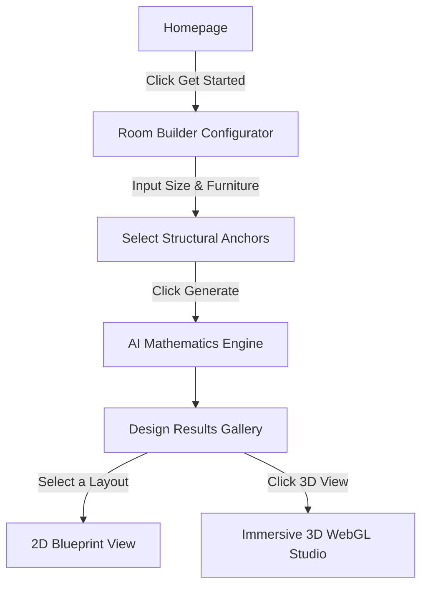
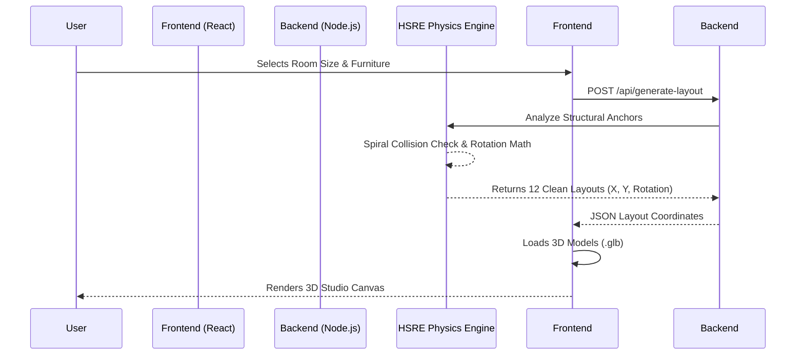

# 🚀 Space Weaver: The Ultimate AI Interior Designer

## 🧸 The Pitch: Explain it Like I'm 5!
Imagine you have an empty bedroom and a bunch of heavy furniture (a bed, a desk, a chair). Usually, you have to push everything around for hours until it fits right without blocking the door. 

**Space Weaver** is like a super-smart robot brain inside your computer. You just tell it how big your room is and what furniture you have. Then, the robot does all the math in milliseconds to find the *perfect* places for everything. It makes sure you don't bump your toes when you walk, ensures your sofa is facing the TV, and even gives you 12 totally different design styles (like a "Cozy" vibe or an "Aesthetic" vibe). Finally, it builds a complete 3D video game version of your room so you can walk around and see it before you move a single real chair!

---

## 🎯 What Does the Website Actually Do?
When a user visits Space Weaver, they go through a seamless, magical journey:

1. **Room Configurator (The Input):** The user enters their room's length and width, adds fixed structural things (like doors, windows, pillars), and selects the furniture they own.
2. **The Vibe Selection:** They tell the app what mood they want (e.g., Space Saver, Cozy & Comfy, Aesthetic).
3. **The AI Brain (The Engine):** The user clicks "Generate", and our custom backend calculates exactly where every piece of furniture should go.
4. **The 3D Reveal:** The user is taken to the Results page, where they can see their layouts from a top-down view, and then click **"3D View"** to immerse themselves in a high-quality 3D render of their new room.

### 🔄 The User Journey Flowchart

---

## 🧠 The Logic: How is it Happening? (The Secret Sauce)

When people hear "AI", they usually think of ChatGPT (an LLM). But language models are terrible at geometry! If you ask ChatGPT to place furniture, it will hallucinate coordinates and put your sofa inside your wall. 

**We don't use LLMs for our layout math.** Instead, we built the **Human Spatial Reasoning Engine (HSRE)**.

### How the HSRE Engine Works:
1. **Focal Point Detection:** The engine looks for the most important item (like a TV or a Fireplace) and anchors the layout around it.
2. **Viewing Cones:** If there's a TV, it calculates a 30-degree ergonomic viewing cone and forces the sofa to face the TV.
3. **Clearance & Circulation:** It guarantees a 36-inch "highway" (walking path) from the door to the window so the room feels spacious and breathable.
4. **Concentric Spiral Placement Algorithm:** If two pieces of furniture try to occupy the exact same spot (overlap/collision), our engine spirals outwards pixel-by-pixel until it finds a 100% clean, empty spot. 0% overlap guaranteed!

### ⚙️ System Architecture Diagram

---

## 🛠️ The Tech Stack (What we are using)
We are using a highly modern, incredibly fast technology stack:

* **Frontend:** 
  * **React.js & TypeScript:** For building a robust, bug-free user interface.
  * **Vite:** For lightning-fast bundling and development.
  * **Tailwind CSS:** For beautiful, responsive, luxury styling.
  * **Three.js & React Three Fiber (R3F):** For rendering the 3D models and lighting directly in the web browser.
  
* **Backend:**
  * **Node.js & Express:** A lightweight server that handles API requests.
  * **Custom JavaScript Math Engine:** Pure trigonometric and geometric code written by us to calculate collisions and clearances (no third-party physics libraries needed!).

---

## 🚀 What We Have Built & Our Plan

### ✅ What is Done:
* **The Configurator:** A beautiful UI to drag-and-drop windows, doors, and select furniture.
* **The Physics Engine:** The backend successfully generates multiple distinct philosophies (The Minimalist, The Intimate Nook, etc.) without collisions.
* **The 3D Studio:** We successfully integrated 3D `.glb` files so the user can see their exact furniture in a 3D space.
* **Infrastructure Fix:** We recently unified the app! The frontend and backend now both run perfectly together on `127.0.0.1:5000` so there are no network errors when fetching the 3D layouts.

### 🔮 The Future Plan (Next Steps):
1. **More Furniture Models:** Adding more 3D assets to our library (plants, rugs, lamps) to make the renders look even more realistic.
2. **Save & Share:** Allowing users to create accounts, save their favorite layouts, and send a link to their friends or interior designers.
3. **Drag & Drop in 3D:** Giving users the ability to manually nudge the furniture in the 3D view and have the engine instantly re-calculate if it's too close to a wall. 
